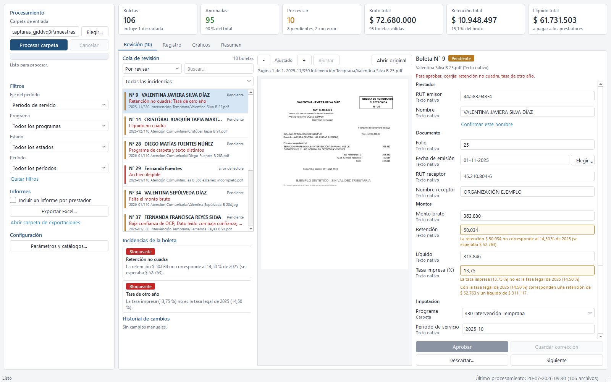
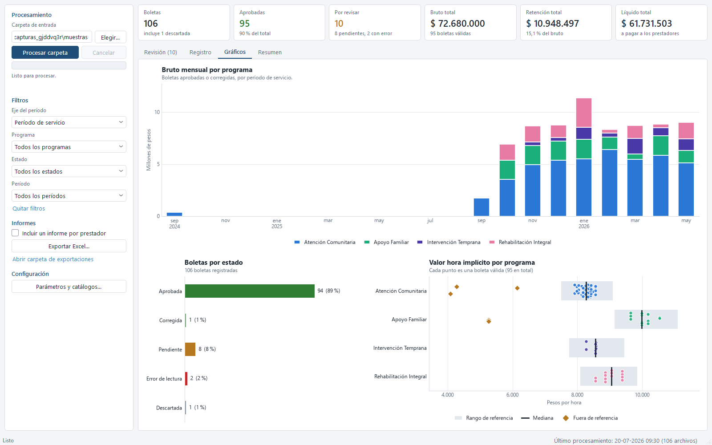
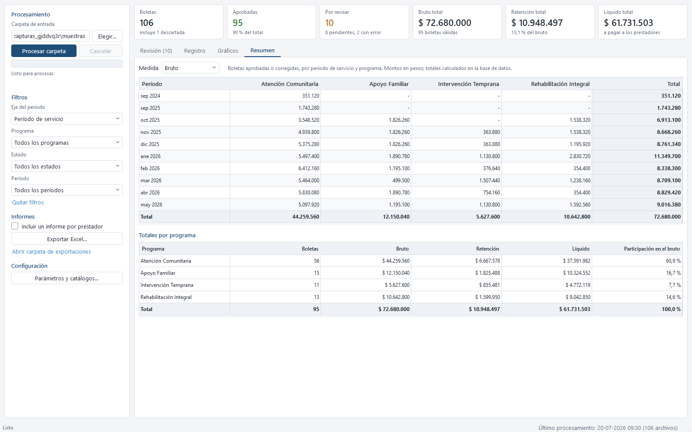

# Lector de boletas de honorarios: resumen ejecutivo

## El problema

Cada mes llegan decenas de boletas de honorarios electrónicas de prestadores externos,
en PDF o como fotografía, muchas veces mezcladas en un mismo archivo con hojas anexas.
Alguien tiene que revisarlas una por una: comprobar que la retención y el líquido
corresponden a la tasa legal del año, que el folio no está repetido, y a qué programa se
debe cargar el gasto, antes de poder cerrar el informe del mes. Hecho a mano, es lento y
un folio mal copiado o una tasa de un año equivocado pasan fácilmente inadvertidos.

## La solución

Un programa de escritorio que procesa una carpeta completa de boletas de una sola vez:
lee el texto de cada archivo (o lo reconoce con lectura óptica si es una imagen o un
PDF escaneado), calcula los montos esperados con la tasa legal del año correspondiente,
detecta boletas repetidas y determina el programa que financia cada pago. Lo que
cuadra queda aprobado solo; lo que no, pasa a una cola de revisión con la página exacta
a la vista y un formulario para corregir, donde cada cambio queda auditado. Al final,
un informe en Excel resume el gasto por programa y por mes.

Los parámetros de la organización (RUT, ventana de fechas aceptada, tolerancias) y el
catálogo de programas (con sus alias de texto y si están activos) se administran desde
la misma interfaz, y también se pueden importar o exportar en Excel para cargar la
información real de la organización sin tocar el código.

## Resultados (sobre el lote sintético de la demo)

- 106 archivos procesados en un lote, 106 boletas registradas.
- 95 aprobadas automáticamente (90 % del total) sin intervención manual.
- 10 quedaron para revisión (8 pendientes de una decisión, 2 con un archivo ilegible),
  cada una con el motivo exacto a la vista: retención que no cuadra, tasa de otro año,
  folio ilegible, monto que falta, confianza baja del OCR.
- Bruto total de las boletas válidas: $ 72.680.000; retención: $ 10.948.497 (15,1 % del
  bruto); líquido a pagar a los prestadores: $ 61.731.503.
- Gasto por programa, con el mayor en Atención Comunitaria (60,9 % del bruto, 56
  boletas) y el resto repartido entre Apoyo Familiar, Intervención Temprana y
  Rehabilitación Integral.

## Capturas

*Cola de revisión: cada boleta muestra su incidencia, la página original y un
formulario que valida en vivo contra la tasa legal del año.*

*Vista de gráficos: gasto mensual por programa, estado de las boletas y el valor hora
implícito de cada una comparado con el rango de referencia del programa.*

*Resumen mensual por programa, con los totales calculados directamente en la base de
datos para que siempre coincidan con el Excel exportado.*
