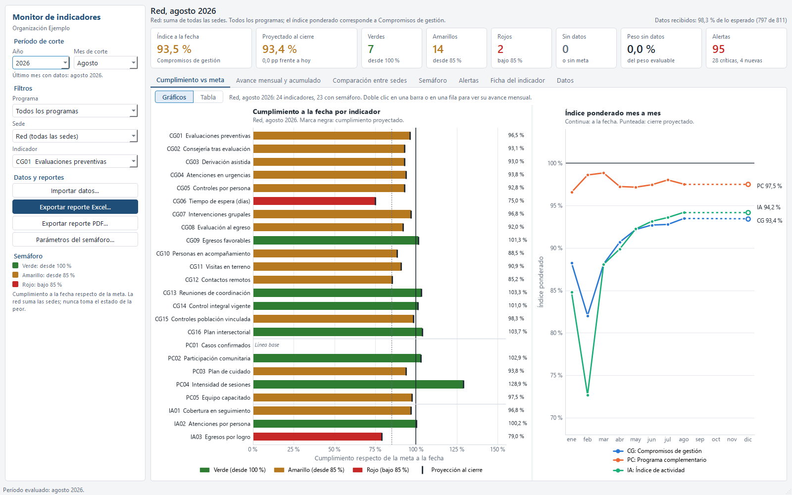
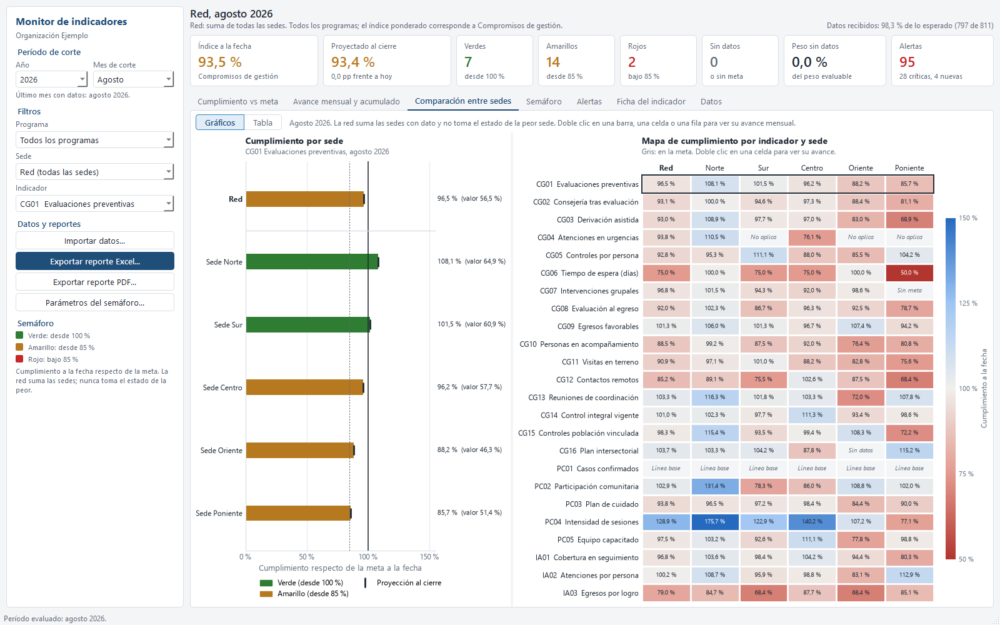
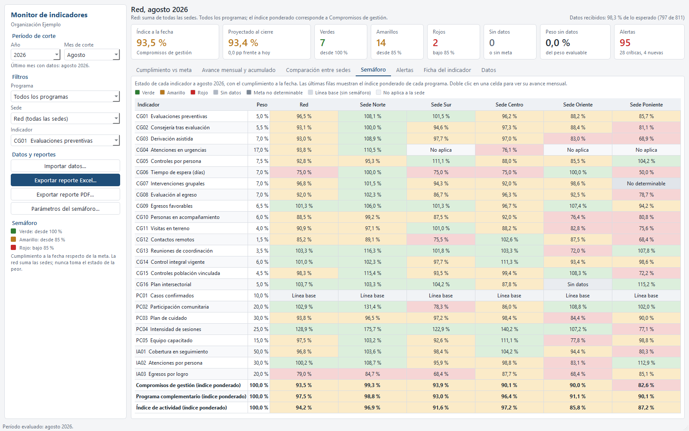

# Monitor de indicadores multisede

## El problema

Una organización con varias sedes compromete cada año un conjunto de indicadores de gestión (por ejemplo, cobertura de personas atendidas, tiempo de espera, actividades comunitarias) con metas anuales. Cada mes llegan datos nuevos por sede. Saber, en cualquier momento del año, cómo va cada indicador, si se va a cumplir al cierre y qué sedes están atrasadas requiere juntar y recalcular a mano cifras de fuentes distintas, con reglas de cálculo distintas para cada tipo de meta. Es un trabajo lento, difícil de mantener al día y con alto riesgo de error (sumar mal un promedio, comparar contra la meta equivocada, no darse cuenta de que una sede dejó de reportar).

## La solución

Una aplicación de escritorio que centraliza el catálogo de indicadores, sus metas y las observaciones mensuales de cada sede, y calcula automáticamente, para cualquier mes de corte:

- El cumplimiento de cada indicador en cada sede y en la red completa, con semáforo (verde, amarillo, rojo).
- Si el indicador va a cumplir la meta al cierre del año, con una proyección y su rango de incertidumbre.
- Un índice ponderado por programa que resume el desempeño global.
- Alertas automáticas (sedes que dejaron de reportar, datos inconsistentes, indicadores en riesgo).
- Un reporte ejecutivo exportable en Excel y en PDF, listo para compartir con la jefatura.

La aplicación permite además importar datos nuevos desde Excel y mantener el catálogo de indicadores editable, para que el equipo pueda actualizar metas y pesos año a año sin depender de cambios en el código.

## Resultados de la demostración

Los siguientes números se obtuvieron con la base de datos sintética de ejemplo que trae la aplicación (24 indicadores de gestión en 5 sedes, 3 años de historia), calculados por la propia aplicación al cierre del período de agosto de 2026:

- Índice ponderado de la red a la fecha: **93,5 %**, con una proyección al cierre del año de **93,4 %**.
- De los 23 indicadores con semáforo evaluados: **7 en verde**, **14 en amarillo** y **2 en rojo**.
- Cobertura de datos reportados por las sedes en el período: **98,3 %** (797 de 811 observaciones esperadas).
- **95 alertas** activas en el período (indicadores en riesgo, sedes sin reporte, posibles subregistros y datos inconsistentes), de las cuales 28 son críticas.

Estas cifras son solo del set de datos sintético de la demostración; con datos reales de una organización, el mismo cálculo se aplica a su propio catálogo de indicadores y metas.

## Capturas

