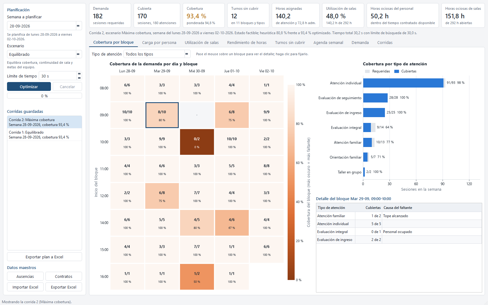
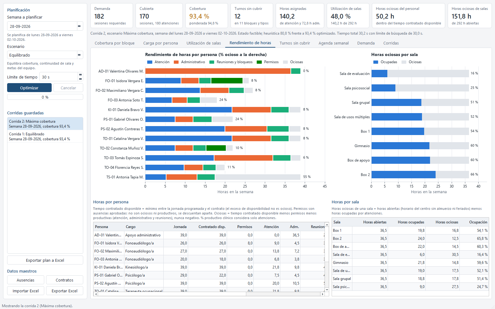
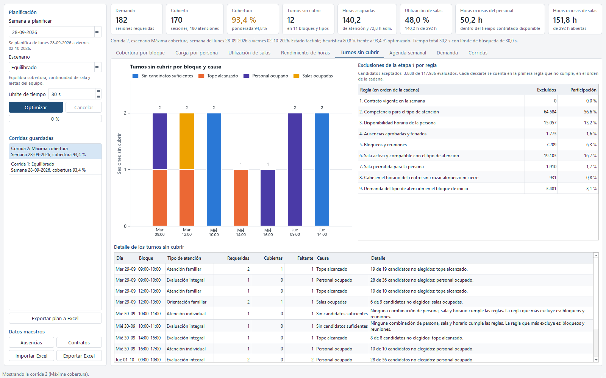

# Optibox: asignación de turnos de personal

## El problema

Armar la agenda semanal de un centro con varias salas y varios cargos a
mano es lento: hay que cuadrar contratos de distinta jornada, horarios
disponibles, ausencias, reuniones y restricciones de sala, sin dejar a
nadie sobre su contrato ni ninguna sesión cruzando el almuerzo. Cuando algo
no se puede cubrir, casi nunca queda claro por qué.

## La solución

Optibox recibe la disponibilidad del equipo, las salas y la demanda de
atenciones de la semana, y arma la agenda de lunes a viernes en dos pasos:
primero filtra y prioriza cada combinación posible de persona, sala y
horario con un conjunto de reglas de negocio, y después un motor de
optimización elige la combinación que cubre más demanda y, dentro de eso,
la de mejor calidad según el escenario elegido (por ejemplo, priorizar
evaluaciones o maximizar la cobertura). Cada turno que queda sin cubrir se
explica con una causa concreta (sin personal disponible, sala ocupada,
tope alcanzado, contrato agotado), y cada plan se valida de forma
independiente antes de guardarse. La planificación se puede exportar a
Excel completa, con la agenda de cada persona y de cada sala.

También mide el rendimiento de horas: cuánto de la jornada
contratada de cada persona y de cada sala quedó realmente ocioso frente a
lo productivo (atención, administrativo y reuniones), separando los
permisos y el almuerzo, que no cuentan como ociosos ni como productivos.

## Resultados de la demo

Con datos sintéticos de un centro de 12 personas y 9 salas, para la semana
de ejemplo:

- Demanda de la semana: 182 sesiones; cubiertas: 170 (93,4 % de cobertura,
  94,8 % ponderada por prioridad). Quedaron 12 sesiones sin cubrir en 11
  combinaciones de bloque y tipo de atención, cada una con su causa.
- 140,2 horas de atención asignadas y 72,8 horas administrativas.
- Utilización de las salas de atención: 48,0 % del horario disponible de
  la semana.
- Horas ociosas del personal: 50,2 horas dentro del tiempo contratado
  disponible de la semana; horas ociosas de las salas: 151,8 horas de las
  292 horas abiertas.
- La heurística inicial (sin optimización) cubría 80,8 % de la demanda
  ponderada; el modelo de optimización llegó a 94,8 % ponderada en 30
  segundos de búsqueda.

## Capturas

