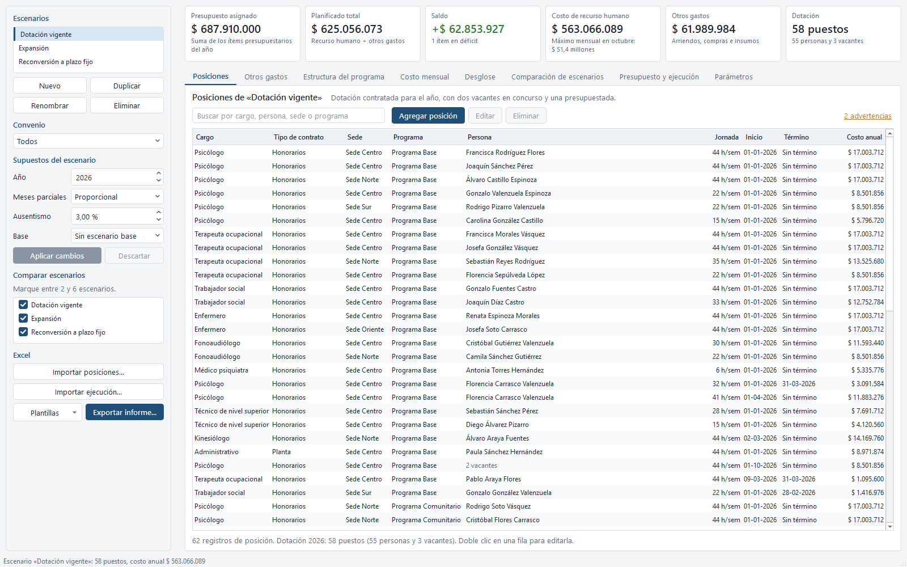
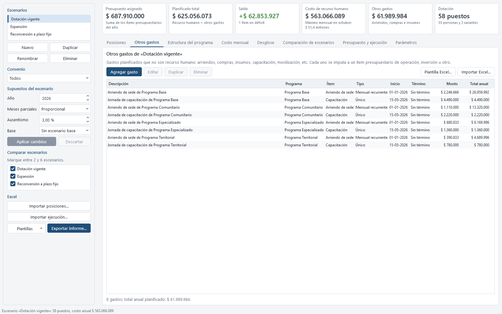
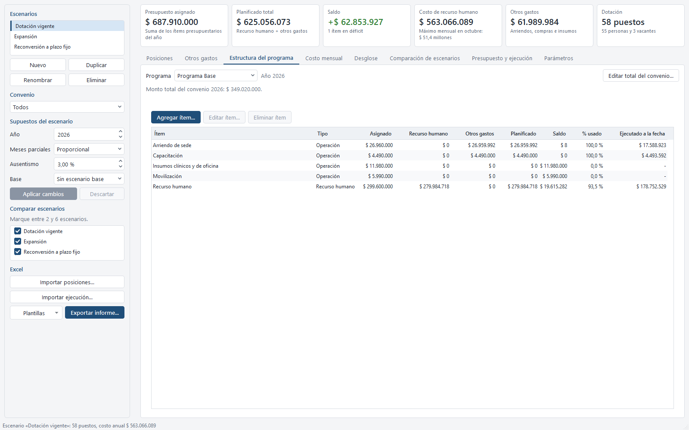
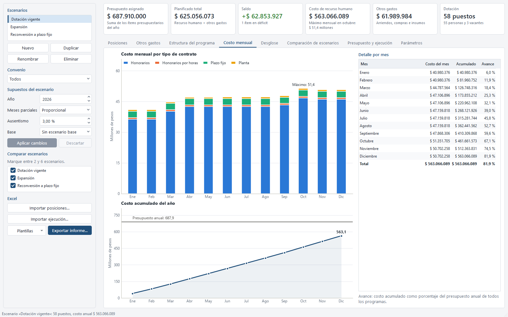
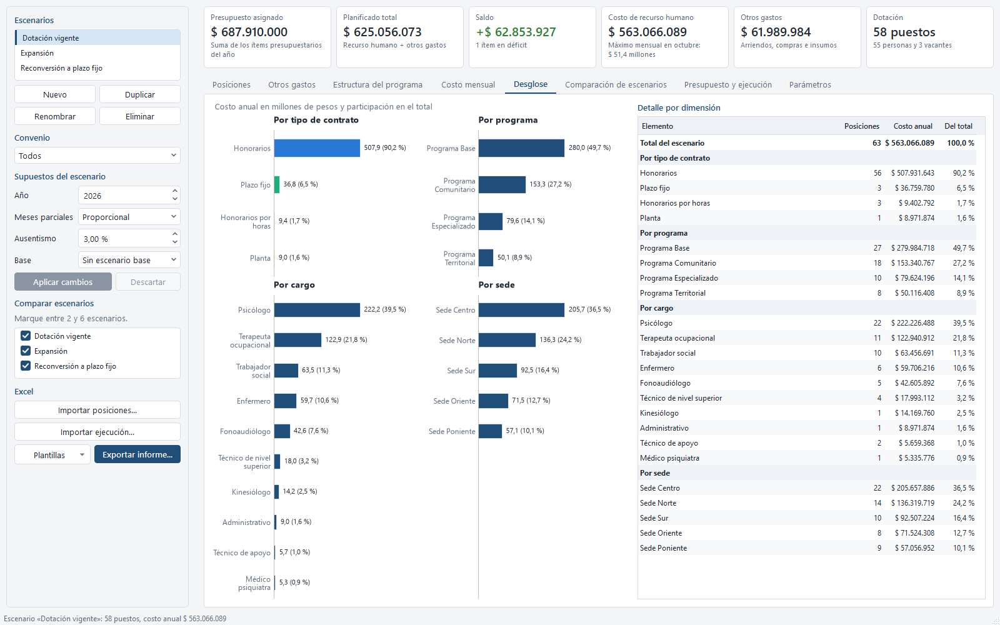
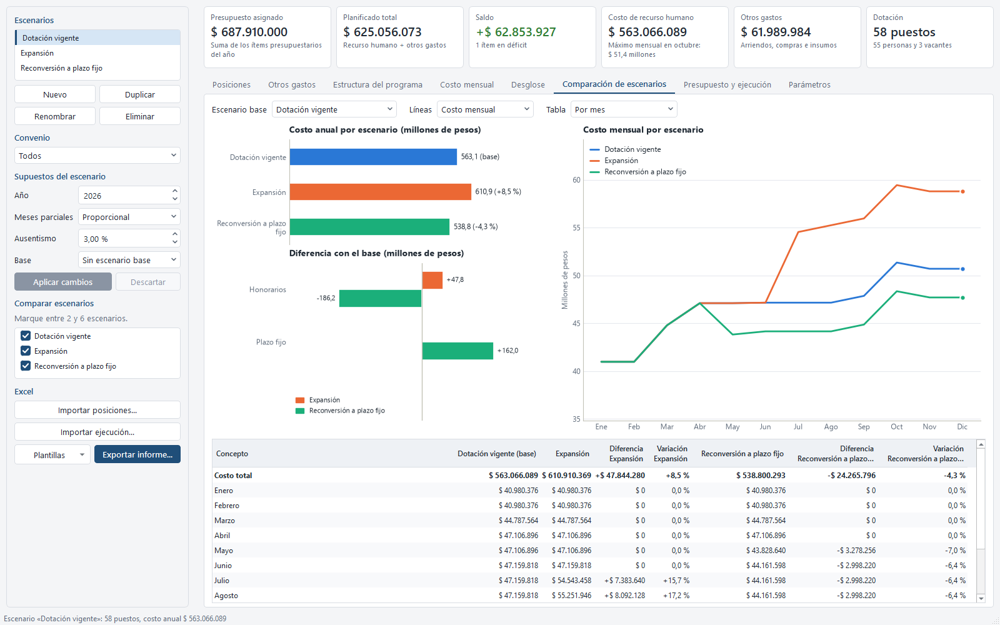
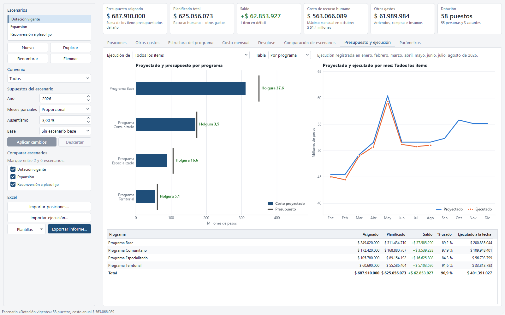
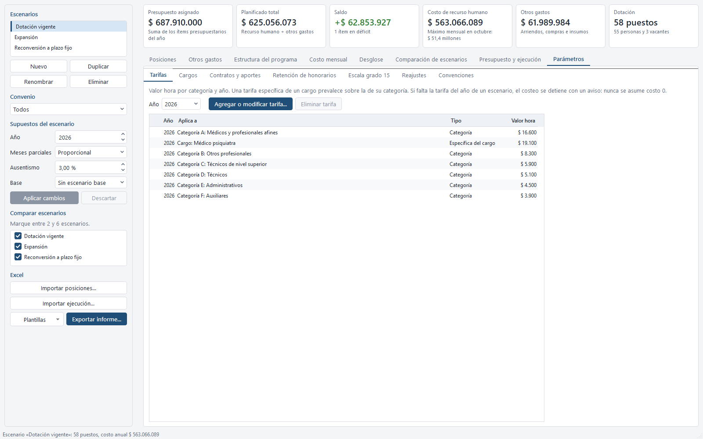
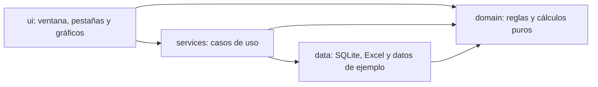
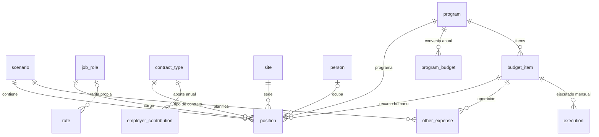

# Simulador de costos de dotación

Aplicación de escritorio para planificar el gasto anual de la dotación y de los otros gastos de una organización multisede según escenarios de contratación, contra la estructura financiera de cada programa (convenio) y, a medida que avanza el año, contra lo efectivamente ejecutado.



## Problema que resuelve

Una organización con varias sedes financia sus equipos con distintos programas (convenios), cada uno con montos asignados por ítem presupuestario: recurso humano, arriendos, compras, capacitación, etc. El personal se contrata con modalidades que se costean de forma distinta (honorarios con jornada semanal, honorarios por horas, plazo fijo y planta con el sueldo de un grado de referencia), con fechas de ingreso y término que no coinciden con el inicio de los meses, cambios de jornada a mitad de año y personas que trabajan en más de un programa a la vez.

Proyectar ese gasto en planillas sueltas lleva a errores difíciles de ver: meses cobrados fuera de contrato, valores hora que faltan y quedan en cero, filas que no entran en los totales, contratos concurrentes que se pierden al consolidar, o gastos de recurso humano y de operación que no se pueden comparar con lo que cada ítem del convenio tiene asignado. Este simulador reemplaza esa práctica por un motor de costeo único, con reglas explícitas y probadas, sobre el que se puede cargar la estructura financiera de cada convenio y construir y comparar escenarios de contratación y de otros gastos.

## Funcionalidades

- **Escenarios**: crear, duplicar (copia profunda de sus posiciones y de sus otros gastos), renombrar, eliminar y editar los supuestos de cada escenario (año, método de meses parciales, ausentismo esperado y escenario base).
- **Posiciones**: alta, edición y baja mediante un diálogo validado que muestra una vista previa del costo anual mientras se completa. Una posición tiene cargo, tipo de contrato, sede, programa, el ítem de recurso humano al que se imputa, persona (o vacante), horas semanales u horas mensuales estimadas, cantidad, grado real (informativo, solo para plazo fijo y planta), fechas de inicio y término y una nota.
- **Otros gastos**: arriendos, compras, insumos, capacitación, movilización y similares, distintos del recurso humano, planificados por escenario e imputados a un ítem de operación, inversión u otro; mensuales recurrentes o únicos, con alta, edición, baja y duplicado.
- **Estructura del programa**: monto total del convenio por programa y año, con vigencia y referencia opcional, e ítems presupuestarios (código, nombre, tipo y monto asignado) con su planificado (recurso humano más otros gastos), saldo, ejecutado a la fecha y porcentaje de uso; aviso si la suma de los ítems no coincide con el total del convenio.
- **Proyección mensual**: costo de recurso humano por posición y mes, totales por mes, acumulado anual y desgloses por tipo de contrato, cargo, sede, programa e ítem presupuestario. Todo agregado se obtiene sumando las líneas por posición y mes.
- **Retención y líquido**: la retención legal de honorarios del año se informa aparte, junto con el líquido estimado; el costo para la organización es el bruto (o la remuneración prorrateada, en plazo fijo y planta).
- **Presupuesto y ejecución**: asignado, planificado y ejecutado por ítem presupuestario o agrupado por programa, con saldo y porcentaje de ejecución; importación desde Excel de los montos ejecutados por ítem y mes.
- **Comparación de escenarios**: entre 2 y 6 escenarios contra un escenario base, con costo total, líneas mensuales o acumuladas y diferencias absolutas y porcentuales por mes, por tipo de contrato y por cargo.
- **Advertencias de jornada**: aviso (sin bloquear) cuando la suma de horas semanales de una persona, en todas sus posiciones y sin importar el tipo de contrato, supera la jornada completa configurada.
- **Parámetros editables con validación**: valor hora de honorarios por categoría y año (con tarifas específicas por cargo), escala del sueldo del grado 15 por categoría y vigencia, reajustes del sector público, tipos de contrato y aportes del empleador, tasas de retención, jornada completa y semanas por mes.
- **Excel**: plantillas con listas desplegables para posiciones, otros gastos y ejecución, importación validada fila por fila con reporte de filas rechazadas, e informe completo del escenario con formato chileno.

## Interfaz

Una sola ventana con un panel lateral (escenarios, filtro de convenio, supuestos, selección de escenarios a comparar y acciones de Excel), una franja de totales siempre visible y ocho pestañas. Las tarjetas de totales muestran el presupuesto asignado (suma de los ítems del año), el planificado total (recurso humano más otros gastos, con su diferencia contra el escenario base si lo tiene), el saldo, el costo de recurso humano (con el mes de mayor costo), los otros gastos y la dotación en puestos (personas más vacantes).

El selector **Convenio** del panel lateral (Todos o un programa) filtra los totales, las tablas y los gráficos de Posiciones, Otros gastos, Estructura del programa, Costo mensual, Desglose y Presupuesto y ejecución; en Comparación de escenarios, acota la comparación a las posiciones de ese convenio en cada escenario. Los servicios (`CostService.project/item_report/kpis/compare`, `ScenarioService.list_positions`, `FinancialService.other_expenses`) aceptan el mismo filtro por programa.

| Pestaña | Contenido |
| --- | --- |
| Posiciones | Tabla con búsqueda, alta, edición y baja; enlace a las advertencias de jornada del escenario. |
| Otros gastos | Tabla de gastos planificados del escenario (no recurso humano), con alta, edición, baja, duplicado e importación Excel. |
| Estructura del programa | Total del convenio y sus ítems presupuestarios por programa, con asignado, planificado, saldo y ejecutado a la fecha. |
| Costo mensual | Barras apiladas por tipo de contrato, línea del acumulado anual contra el asignado y detalle por mes. |
| Desglose | Costo anual y participación por tipo de contrato, programa, cargo y sede. |
| Comparación de escenarios | Costo total por escenario, diferencias con el base por tipo de contrato, líneas mensuales o acumuladas y tabla de diferencias por mes, tipo de contrato o cargo. |
| Presupuesto y ejecución | Asignado, planificado y ejecutado por ítem o por programa, y planificado contra ejecutado por mes, para todos los ítems o uno. |
| Parámetros | Valor hora de honorarios, cargos, contratos y aportes, retención de honorarios, escala del grado 15, reajustes y convenciones. |















## Arquitectura

El código está separado en cuatro capas. La dependencia va siempre hacia el dominio, y un test (`tests/test_architecture.py`) revisa los `import` de cada capa para que la regla no se rompa.



- `domain`: lógica pura con dataclasses inmutables, `Decimal` y `date`. No usa SQLite, archivos ni Qt.
- `data`: esquema SQLite, repositorios que devuelven objetos de dominio, generador sintético y lectura o escritura de Excel con openpyxl. No conoce la interfaz ni los servicios.
- `services`: casos de uso que orquestan dominio y datos. Cada llamada abre su propia conexión, por lo que se pueden usar desde hilos de trabajo.
- `ui`: PySide6 con gráficos matplotlib embebidos. Solo habla con los servicios y con los modelos de dominio.
- `errors.py`: `AppError` y sus subclases (`ValidationError`, `MissingParameterError`, `NotFoundError`, `DataError`, `OperationCancelledError`) llevan un mensaje en español apto para mostrarse; la interfaz lo presenta en un diálogo y el detalle técnico queda en el log.

### Módulos

| Módulo | Responsabilidad |
| --- | --- |
| `app.py` | Argumentos de línea de comandos, log, creación y siembra de la base, ventana, autoprueba y capturas. |
| `paths.py` | Carpeta de datos (base, logs y exportaciones) desde el código o desde el ejecutable. |
| `logging_setup.py` | Log rotativo en archivo y, si hay consola, también en ella. |
| `errors.py` | Jerarquía de errores esperados con mensaje para el usuario. |
| `domain/models.py` | Entidades (sede, programa, cargo, tipo de contrato, persona, ítem presupuestario, otro gasto, escenario, posición, ejecución) y enumeraciones. |
| `domain/units.py` | Conversión de horas a minutos, porcentajes a puntos básicos y redondeo a peso con `ROUND_HALF_UP`. |
| `domain/calendar.py` | Calendario real día a día: reparto de la jornada de lunes a viernes y horas programadas por tramo y por mes. |
| `domain/parameters.py` | Tablas de valor hora, escala del grado 15 con reajustes, retenciones, aportes y convenciones (jornada completa, semanas por mes); error claro si falta un dato. |
| `domain/costing.py` | Costo de una posición en cada mes (`CostLine`): bruto o remuneración, descuento por ausentismo, aporte, costo y retención. |
| `domain/projection.py` | Proyección de un escenario: totales mensuales, acumulado, desgloses por dimensión (incluido el ítem presupuestario) y resumen de dotación. |
| `domain/comparison.py` | Comparación de escenarios contra un base: diferencias absolutas y porcentuales. |
| `domain/budget.py` | Asignado, planificado (recurso humano más otros gastos) y ejecutado por ítem presupuestario, y su agregación por programa. |
| `domain/validation.py` | Validación de escenarios y posiciones, detección de registros idénticos y advertencias de jornada por persona. |
| `domain/imports.py` | Resultado de una importación: filas aceptadas, rechazadas con su motivo y si se aplicó. |
| `domain/rut.py`, `domain/text.py` | Dígito verificador y formato del RUT; concordancia de plurales en los mensajes. |
| `data/db.py`, `data/schema.sql` | Conexión con claves foráneas activas, esquema versionado con `PRAGMA user_version` y transacciones. Un cambio de versión de esquema pide regenerar la base con `--reiniciar-datos`. |
| `data/repositories.py` | Repositorios de catálogo, parámetros, estructura financiera, escenarios y ejecución. |
| `data/seed.py` | Generador sintético reproducible (semilla fija). |
| `data/excel_import.py` | Plantillas y lectura validada fila por fila de posiciones, otros gastos y ejecución. |
| `data/excel_export.py`, `data/excel_style.py` | Informe Excel del escenario y formatos de celda. |
| `services/scenario_service.py` | Escenarios y posiciones: crear, duplicar, editar, eliminar, validar, imputar el ítem por defecto y advertir. |
| `services/cost_service.py` | Proyección, indicadores, informe por ítem, comparación y vista previa del costo de una posición. |
| `services/parameter_service.py` | Lectura y edición validada de los parámetros de costeo. |
| `services/financial_service.py` | Estructura financiera: total del convenio, ítems presupuestarios y otros gastos. |
| `services/execution_service.py` | Registro e importación de la ejecución por ítem. |
| `services/excel_service.py` | Importación de posiciones y otros gastos, y exportación del informe. |
| `services/common.py` | Base de los servicios: conexión por llamada, reloj, avance y cancelación. |
| `ui/main_window.py`, `ui/side_panel.py`, `ui/tabs/` | Ventana principal, panel lateral y una clase por pestaña. |
| `ui/presenters.py`, `ui/charts.py` | Conversión de resultados en filas y textos, y dibujo de los gráficos. |
| `ui/forms.py`, `ui/dialogs.py` | Diálogos de escenario, posición, importación y advertencias; mensajes y confirmaciones. |
| `ui/widgets.py`, `ui/workers.py` | Tarjetas de totales, lienzo de gráficos, tablas, y tareas en segundo plano con avance y cancelación. |
| `ui/style.py`, `ui/formatting.py`, `ui/capture.py` | Paleta y estilo, formato chileno de números, fechas y montos, y capturas para la documentación. |

### Flujo de datos

1. Al arrancar, `app.py` resuelve la carpeta de datos, configura el log y, si la base no existe, crea el esquema y la puebla con el generador sintético.
2. La ventana pide datos a los servicios (`Services`). Cada llamada abre una conexión SQLite y los repositorios devuelven objetos de dominio.
3. `CostService` arma los parámetros de costeo (valor hora, escala del grado 15 con reajustes, retenciones, aportes y convenciones) y llama a `project_scenario`, que produce doce líneas de costo por posición, una por mes.
4. `Projection` suma esas líneas para obtener totales, acumulados, desgloses y dotación; `item_report` (en `domain/budget.py`) cruza esas líneas con los ítems presupuestarios, los otros gastos y la ejecución para obtener el asignado, lo planificado y lo ejecutado; `compare_projections` construye los contrastes con otros escenarios.
5. `ui/presenters.py` convierte los resultados en filas y textos y `ui/charts.py` dibuja los gráficos. La comparación de escenarios, las importaciones y la exportación corren en hilos de trabajo con barra de avance y opción de cancelar.
6. En una importación, `data/excel_import.py` valida cada fila sin escribir en la base y el servicio guarda todas las filas aceptadas en una sola transacción, o ninguna. El informe se escribe en un archivo temporal que reemplaza al destino solo al final.

### Modelo de datos

SQLite con `PRAGMA foreign_keys = ON`, claves primarias, claves foráneas, `CHECK` y `UNIQUE`. Las fechas se guardan como texto ISO, el dinero en pesos enteros, las horas en minutos enteros (7,5 h = 450) y los porcentajes en puntos básicos (15,25 % = 1525). La versión del esquema es la 3; un cambio de versión de esquema no migra bases anteriores, y la aplicación pide usar `--reiniciar-datos` para regenerarla.



| Tabla | Contenido y restricciones principales |
| --- | --- |
| `site` | Sedes (código y nombre únicos). |
| `program` | Programas o convenios (código y nombre únicos). |
| `program_budget` | Monto total del convenio de un programa en un año, con vigencia y referencia opcionales; clave (programa, año). |
| `budget_item` | Ítem presupuestario de un programa y año: código único por programa y año, nombre, tipo (recurso humano, operación, inversión u otro) y monto asignado. |
| `job_role` | Cargos con su categoría de tarifa (A a F). |
| `rate` | Valor hora de honorarios por año, de una categoría o de un cargo específico (exactamente uno de los dos); únicos por (categoría, año) y (cargo, año). |
| `salary_scale` | Sueldo mensual del grado 15 (jornada completa) de una categoría, vigente desde una fecha. |
| `salary_adjustment` | Reajuste del sector público, multiplicativo desde una fecha de vigencia (solo plazo fijo y planta). |
| `contract_type` | Código, nombre, forma de costeo (`weekly_fee`, `hourly_fee`, `salaried`) y si aplica retención (nunca en dependientes). |
| `employer_contribution` | Aporte del empleador por tipo de contrato y año, en puntos básicos. |
| `retention_rate` | Tasa de retención de honorarios vigente desde un año. |
| `setting` | Convenciones: semanas por mes, año de la tasa de retención y jornada completa. |
| `person` | Personas con nombre y RUT opcional único. |
| `scenario` | Nombre único, descripción, año, método de meses parciales, ausentismo esperado (0 a 50 %), escenario base opcional (referencia a otro escenario, sin ciclos) y fechas de creación y actualización. |
| `position` | Posición de un escenario (se borra con él): cargo, tipo de contrato, sede, programa, ítem de recurso humano, persona opcional, horas semanales u horas mensuales (exactamente una de las dos), cantidad de 1 a 100 (1 si tiene persona), grado (informativo), inicio, término opcional no anterior al inicio y nota. |
| `other_expense` | Gasto planificado de un escenario, imputado a un ítem que no es de recurso humano: descripción, tipo (mensual recurrente o único), vigencia y monto. |
| `execution` | Monto ejecutado por ítem presupuestario y mes; clave (ítem, mes). |

## Reglas de negocio y decisiones de diseño

### Valor hora de honorarios y sueldo del grado 15

El valor hora de honorarios se busca por cargo y año: si el cargo tiene tarifa propia en ese año se usa esa; si no, la de su categoría. Si falta, el costeo se detiene con un mensaje que indica qué cargar en Parámetros; nunca se asume costo 0. Un cargo que tiene tarifa propia en otros años pero no en el año pedido también produce un error, para no costearlo en silencio con la tarifa general de su categoría.

El costo de plazo fijo y planta no usa el valor hora de honorarios: el programa paga solo el sueldo del grado 15 de la categoría de la persona, una escala editable con vigencia por fecha (no por año). Los reajustes del sector público son una tabla editable (fecha de vigencia, porcentaje, descripción) que se aplica de forma multiplicativa, a los meses desde su fecha de vigencia, solo sobre las escalas cargadas antes de esa fecha, para que un reajuste no se aplique dos veces sobre una escala que ya lo incluye. Si la persona tiene un grado real distinto de 15, se puede registrar como dato informativo en la posición: la diferencia la asume el municipio, fuera del programa.

### Costo mensual por tipo de contrato

Sea $VH$ el valor hora de honorarios, $h_s$ las horas semanales, $h_m$ las horas mensuales estimadas, $s$ las semanas por mes y $J$ la jornada completa (44 h en atención primaria). Por convención de los contratos $s = 4$; es un parámetro editable y nunca se mezcla con las horas del calendario.

Honorarios con jornada semanal (costo para la organización = bruto):

$$B = VH \cdot h_s \cdot s$$

Honorarios por horas (las horas mensuales estimadas son obligatorias para este tipo):

$$B = VH \cdot h_m$$

Plazo fijo y planta, con sueldo del grado 15 vigente (con reajustes) $S_{15}$ y aporte del empleador $c$ del tipo de contrato y del año:

$$R = S_{15} \cdot \frac{h_s}{J} \qquad \text{Costo} = R + \operatorname{redondeo}(R \cdot c)$$

Con $VH = 10.000$, una jornada honoraria de 44 h da un bruto mensual de 1.760.000 pesos; con $S_{15} = 1.180.000$ (categoría profesional, escala 2026 de los datos de ejemplo), la remuneración de plazo fijo o planta a la misma jornada completa es 1.180.000 pesos, sin relación con el valor hora de honorarios.

### Vigencia y meses parciales

Una posición cuesta en los meses que intersectan su vigencia. Un término vacío significa vigencia hasta fin de año, y el inicio no puede ser posterior al término (se valida en el formulario, en la importación y en la base). Cada escenario elige uno de dos métodos:

- **Proporcional** (por defecto): el mes de ingreso o de término se paga en proporción a lo vigente.
- **Mes completo**: cualquier mes con al menos un día de vigencia se paga entero.

En honorarios con jornada semanal, la proporción se calcula con un calendario real día a día: la jornada se reparte de lunes a viernes (44 h queda como 9, 9, 9, 9 y 8 h) y se cuentan las horas programadas de cada día del mes, sin columnas fijas por semana, de modo que los meses que tocan seis semanas calendario se cuentan completos.

$$B_{\text{mes}} = B \cdot \frac{H_{\text{vigente}}}{H_{\text{mes}}}$$

donde $H_{\text{mes}}$ son las horas programadas del mes y $H_{\text{vigente}}$ las que caen dentro de la vigencia. Por ejemplo, con 44 h semanales marzo de 2026 tiene 194 h programadas; una posición que ingresa el lunes 9 tiene 150 h vigentes y cobra $1.760.000 \cdot 150 / 194 = 1.360.825$ pesos. Se usa esta fracción y no la resta $B - VH \cdot H_{\text{fuera}}$ porque la resta mezcla la convención de cuatro semanas (176 h al mes para 44 h) con horas de calendario (entre 176 y 203 h en 2026): con ella, un ingreso en la última semana de un mes largo podría costar 0 y dividir una posición en dos tramos cambiaría su costo. Con la fracción, un tramo con horas vigentes nunca cuesta 0 y dos tramos consecutivos suman exactamente lo mismo que la posición entera.

En honorarios por horas la proporción es la de días hábiles (lunes a viernes) vigentes sobre los del mes, y en plazo fijo y planta la de días corridos vigentes sobre los días del mes. Los feriados no se descuentan: cuentan como horas programadas.

### Ausentismo esperado

El ausentismo $a$ es un supuesto del escenario (porcentaje de las horas contratadas del mes, entre 0 y 50 %). En honorarios cada hora no trabajada se descuenta al valor hora, con el pago acotado entre 0 y el bruto:

$$h_{nt} = a \cdot h_c \qquad \text{Pago} = \min\left(B_{\text{mes}},\ \max\left(B_{\text{mes}} - VH \cdot h_{nt},\ 0\right)\right)$$

donde $h_c$ son las horas contratadas del mes ($h_s \cdot s$ prorrateadas, o $h_m$). Con 3 % de ausentismo, una jornada de 44 h descuenta 5,28 h al mes. En plazo fijo y planta el ausentismo no reduce el costo.

### Retención de honorarios

La retención no cambia el costo para la organización: se informa aparte como $r = \operatorname{redondeo}(\text{Pago} \cdot t)$, y el líquido estimado es $\text{Pago} - r$, con $t$ la tasa legal del año, que es un dato público editable: 2020 10,75 %, 2021 11,5 %, 2022 12,25 %, 2023 13 %, 2024 13,75 %, 2025 14,5 %, 2026 15,25 %, 2027 16 % y 17 % desde 2028. Una convención permite tomar la tasa del año del servicio (por defecto) o la del año del pago, en cuyo caso diciembre, que se paga en enero, usa la tasa del año siguiente. Plazo fijo y planta no tienen retención.

### Redondeo y totales

Los cálculos se hacen con `Decimal`. Cada monto unitario de una posición en un mes (bruto o remuneración, descuento, aporte y retención) se redondea a peso entero con `ROUND_HALF_UP` y luego se multiplica por la cantidad. Todos los totales (por mes, acumulado, por tipo de contrato, cargo, sede, programa, ítem presupuestario y escenario) salen de sumar esas líneas, por lo que cualquier desglose suma exactamente el total: ninguna posición ni mes puede quedar fuera de un resumen.

### Dotación, tramos y posiciones concurrentes

- Una posición puede tener cantidad mayor que 1 para representar puestos idénticos (por ejemplo, dos vacantes iguales).
- Una persona puede tener varias posiciones concurrentes (en distintos programas) o sucesivas (un cambio de jornada o una reconversión a plazo fijo se modela como dos tramos). Todas se costean; no se consolidan por persona. Solo se rechaza un registro idéntico a otro del mismo escenario (mismo cargo, contrato, sede, programa, persona, horas y fechas; el ítem y el grado no distinguen).
- La dotación se informa en puestos: personas distintas con vigencia en el año más vacantes. Una persona con dos tramos cuenta una vez.
- Las horas semanales de la posición son el promedio del año ponderado por días de vigencia; los contratos por horas aportan su equivalente semanal ($h_m / s$).

### Advertencias de jornada

Se advierte sin bloquear cuando la suma de horas semanales de una persona, en todas sus posiciones vigentes y sin importar el tipo de contrato, supera la jornada completa (44 h por defecto, editable) en algún tramo del año. Da lo mismo en cuántos registros esté repartida la jornada: 22 h + 22 h de honorarios se tratan igual que una posición de 44 h, y una posición de plazo fijo más honorarios se suman de la misma forma.

### Estructura financiera, presupuesto y ejecución

Cada programa tiene, por año, un monto total de convenio (`program_budget`, con vigencia y una referencia de texto opcional) e ítems presupuestarios (`budget_item`) de recurso humano, operación, inversión u otro. Cada posición se imputa a un ítem de recurso humano de su programa (el primero, por defecto); cada otro gasto se imputa a un ítem que no sea de recurso humano.

$$\text{Planificado} = \text{Costo de recurso humano} + \text{Otros gastos} \qquad \text{Saldo} = \text{Asignado} - \text{Planificado} \qquad \text{Uso} = \frac{\text{Planificado}}{\text{Asignado}}$$

La pestaña Estructura del programa avisa (sin bloquear) cuando la suma de los ítems de un programa no coincide con el monto total de su convenio.

$$\text{Diferencia de ejecución} = E - P \qquad \text{Variación} = \frac{E - P}{P}$$

Lo planificado ($P$) y lo ejecutado ($E$) se comparan celda a celda (ítem y mes): un mes que un ítem aún no registra no entra en la comparación «a la fecha», y la pantalla y el informe usan la misma definición del acumulado. La ejecución por programa se obtiene sumando la de sus ítems.

En la comparación de escenarios, para cada concepto (total, mes, tipo de contrato o cargo) la diferencia es $X - X_{\text{base}}$ y la diferencia porcentual $(X - X_{\text{base}}) / X_{\text{base}}$, que queda vacía si el valor base es 0. Un elemento que no existe en un escenario vale 0 en él.

### Importación y exportación Excel

- La plantilla de posiciones trae listas desplegables de cargos, tipos de contrato, sedes, programas e ítems de recurso humano, una hoja de instrucciones y una fila de ejemplo; el ítem es opcional (se imputa el primero del programa si se deja vacío). La de otros gastos trae listas de programas, ítems que no son de recurso humano y tipo de gasto. La de ejecución trae una fila por ítem y mes; las filas sin monto se omiten.
- Cada fila se valida por separado (catálogos, fechas, horas según el tipo de contrato, cantidad, grado, RUT con dígito verificador, valor hora o escala existente, duplicados dentro de la planilla o contra el escenario) y el reporte muestra cada fila rechazada con su motivo.
- Si hay filas con errores no se importa nada, salvo que el usuario elija importar solo las filas válidas. Las personas nuevas, las posiciones y los otros gastos se guardan en una sola transacción: una importación nunca queda a medias, tampoco si se cancela.
- El informe del escenario tiene las hojas Supuestos (incluye advertencias), Posiciones, Costo mensual (por posición), Resumen mensual, Por tipo, Por cargo, Por sede, Por programa, Estructura por programa, Estructura por ítem, Otros gastos y, si hay dos o más escenarios marcados para comparar, Comparación. Los montos usan el formato `#,##0`, los porcentajes `0.0%`, las fechas son fechas de Excel, los encabezados van en negrita y el panel queda congelado en la fila de encabezado.

### Otras decisiones

- Los parámetros de costeo están versionados por fecha o por año en tablas, no en el código. El aporte del empleador de plazo fijo y planta es 0 % por defecto: no se inventó una tasa que el usuario no pidió.
- Cambiar el año de un escenario pide confirmación e informa cuántas posiciones quedan sin vigencia en el año nuevo, porque no sumarían costo.
- Los servicios no comparten conexiones y el trabajo pesado corre fuera del hilo de la interfaz; los widgets solo se tocan desde el hilo principal.

## Datos de ejemplo

La primera ejecución crea la base y la puebla con un caso sintético generado con semilla fija (2026), de modo que cada corrida produce exactamente los mismos datos (hay un test de determinismo). Los nombres combinan listas de nombres y apellidos comunes, y los RUT están en el rango 40.000.000 a 45.999.999 con dígito verificador válido. La estructura, las proporciones y las magnitudes imitan un caso real de planificación de dotación, sin reproducir ningún dato identificable.

- **Catálogos**: 5 sedes (Centro, Norte, Sur, Oriente y Poniente), 4 programas (Base, Comunitario, Especializado y Territorial), 13 cargos en 6 categorías de tarifa y 4 tipos de contrato: Honorarios (jornada semanal), Honorarios por horas, Plazo fijo y Planta.
- **Estructura financiera**: 20 ítems presupuestarios (uno de recurso humano y cuatro de operación —arriendo, insumos, capacitación y movilización— por programa), con el ítem de recurso humano calibrado al costo proyectado de la dotación vigente y el total del convenio de cada programa igual a la suma de sus ítems.
- **Valor hora de honorarios 2026**: categoría A 16.600, B 8.300 (tarifa profesional), C 5.900, D 5.100, E 4.500 y F 3.900 pesos, y una tarifa propia de 19.100 pesos para el cargo de médico psiquiatra, cerca de 2,3 veces la profesional. Las de 2025 y 2027 aplican reajustes de -4,2 % y +3,8 %, redondeados a decenas.
- **Escala del grado 15** (vigente desde 2025): categoría A 2.150.000, B 1.180.000, C 890.000, D 780.000, E 720.000 y F 650.000 pesos; reajustes del sector público de +3,0 % desde diciembre de 2025 y +1,4 % desde junio de 2026 (valores aproximados, editables).
- **Parámetros**: tasas legales de retención de 2020 a 2028, aporte del empleador 0 % por defecto, 4 semanas por mes y jornada completa de 44 h.
- **Escenario «Dotación vigente»** (año 2026, proporcional, ausentismo 3 %): 62 registros de posición para 55 personas y 3 vacantes, con la mezcla de jornadas de 44, 41, 37, 35, 33, 32, 30, 28, 22, 18, 15, 11, 7,5 y 6 h. Incluye los casos que el motor debe resolver: una persona con dos posiciones simultáneas en programas distintos, dos cambios de jornada a mitad de año modelados como tramos (abril y el 9 de marzo), tres contratos por horas (38 y 30 h mensuales), contratos cortos (un reemplazo de tres semanas, un contrato de cuatro semanas y refuerzos de verano), el cargo con tarifa propia, dos vacantes iguales en una posición de cantidad 2, una vacante presupuestada, un cargo de planta y dos de plazo fijo (uno con grado real 12, distinto del grado 15 con el que se costea), y dos personas cuya carga semanal supera la jornada completa. Cada programa tiene además un arriendo mensual y una jornada de capacitación planificados.
- **Escenario «Expansión»**: la dotación vigente más siete posiciones vacantes en los cuatro programas desde julio (una desde el 3 de agosto).
- **Escenario «Reconversión a plazo fijo»**: los honorarios anuales de 22 h o más de los programas Base y Comunitario pasan a plazo fijo desde mayo, modelados como dos tramos por persona; como el costo pasa a basarse en el sueldo del grado 15 en vez del valor hora de honorarios, el resultado puede ser más barato o más caro que el escenario vigente según la categoría.
- **Ejecución**: montos de enero a agosto de 2026 por ítem, iguales a lo planificado por un factor aleatorio cercano a 0,99 (entre 0,95 y 1,03), con un mes atípico en el programa Comunitario.

Con estos datos, la dotación vigente cuesta 563.066.089 pesos de recurso humano más 61.989.984 de otros gastos (625.056.073 planificado) contra 687.910.000 asignados en los 20 ítems (saldo de 62.853.927); la expansión suma 47.844.280 pesos de recurso humano (+8,5 %) y la reconversión a plazo fijo lo reduce en 24.265.796 (-4,3 %). El detalle está en [RESUMEN_EJECUTIVO.md](RESUMEN_EJECUTIVO.md).

## Cómo ejecutarlo

### Desde el código

Requiere Python 3.11 o superior en Windows. Desde la carpeta del proyecto:

```powershell
python run.py
```

Si `python` no apunta a una versión 3.11 o superior, use el lanzador de Windows, por ejemplo `py -3.12 run.py`. El script `run.py` solo usa la biblioteca estándar: la primera vez crea el entorno virtual `.venv` en la carpeta del proyecto, y en cada ejecución instala las dependencias que falten y las actualiza dentro de los rangos declarados en `pyproject.toml` (PySide6, matplotlib y openpyxl) antes de abrir la ventana. Si no hay conexión a internet, continúa con lo que ya está instalado. Para omitir la consulta al índice de paquetes:

```powershell
$env:MA_SKIP_UPDATE = "1"; python run.py
```

Los datos quedan en la carpeta `data` del proyecto: la base `staffing_simulator.db`, el log `logs\aplicacion.log` y la carpeta `exportaciones`, que es la ubicación sugerida para plantillas e informes.

Opciones de la aplicación (se pasan igual a `run.py` o al ejecutable):

| Opción | Efecto |
| --- | --- |
| `--datos <carpeta>` | Usa otra carpeta de datos. También se puede fijar con la variable de entorno `STAFFING_SIMULATOR_DATA_DIR`. |
| `--reiniciar-datos` | Borra la base y la regenera con los datos de ejemplo (se pierden los cambios). |
| `--autotest` | Abre la ventana, recorre todas las pestañas, dibuja los gráficos, valida que haya datos y sale con código 0 si todo está bien. |
| `--capturas <carpeta>` | Guarda una captura de 1600x1000 por pestaña en la carpeta indicada y sale. |

Las capturas de `docs/img` se generaron con datos de ejemplo recién creados:

```powershell
python run.py --datos $env:TEMP\simulador-capturas --reiniciar-datos --capturas docs/img
```

### Desde el ejecutable

`SimuladorDotacion.exe` es autocontenido: no necesita Python y abre la ventana directamente. La primera vez crea la carpeta `data` junto al ejecutable (por ejemplo `dist\data\`) con la base sintética, los logs y las exportaciones. Si esa carpeta no admite escritura, los datos quedan en `%LOCALAPPDATA%\ManagementAnalytics\SimuladorDotacion`. Para empezar de nuevo con los datos de ejemplo basta con borrar la carpeta `data` o abrir el ejecutable con `--reiniciar-datos`.

## Tests y estilo

Las herramientas de desarrollo se instalan una vez en el mismo entorno virtual (necesita conexión a internet):

```powershell
.venv\Scripts\python -m pip install -e ".[dev]"
```

Luego, desde la carpeta del proyecto:

```powershell
.venv\Scripts\python -m pytest
.venv\Scripts\python -m ruff check .
.venv\Scripts\python -m ruff format --check .
```

La suite tiene 303 casos y corre en menos de un minuto. Las pruebas de interfaz usan `QT_QPA_PLATFORM=offscreen`, por lo que no abren ventanas.

| Archivo | Qué cubre |
| --- | --- |
| `test_calendar.py` | Horas programadas por mes con el calendario real (lunes a jueves 9 h y viernes 8 h en 2026: 193, 176, 194, 194, 184, 194, 202, 185, 194, 193, 185 y 203 h), meses que tocan seis semanas y reparto de la jornada. |
| `test_costing.py` | Fórmulas de honorarios semanales, por horas y de plazo fijo o planta (sueldo del grado 15); aporte, retención y líquido; ausentismo con tope; vigencia y término; prorrateo proporcional contra mes completo; tramos; redondeo; valor hora o escala faltante. |
| `test_projection.py` | Invariante suma de partes igual al total en cada desglose, posiciones concurrentes, cambio de jornada y dotación. |
| `test_comparison_budget.py` | Diferencias entre escenarios y el informe de asignado, planificado y ejecutado por ítem presupuestario. |
| `test_validation.py` | Validación de escenarios y posiciones, registros idénticos, advertencias de jornada, grado, RUT y unidades. |
| `test_persistence.py` | Esquema y restricciones, versión de esquema, repositorios y determinismo del generador. |
| `test_services.py` | Casos de uso sobre una base sembrada en una carpeta temporal, incluida la copia profunda al duplicar (posiciones y otros gastos). |
| `test_excel.py` | Importación con rechazo de filas inválidas sin importar a medias, plantillas y formato e integridad del informe. |
| `test_ui.py`, `test_ui_smoke.py` | Presentadores, pestañas, diálogos y autoprueba de la ventana. |
| `test_architecture.py` | Reglas de dependencia entre capas. |

## Cómo generar el ejecutable

Desde la carpeta del proyecto, en PowerShell:

```powershell
.\build.ps1
```

El script prepara `.venv` si no existe, instala las dependencias de ejecución, desarrollo y construcción, corre los tests, genera `dist\SimuladorDotacion.exe` con PyInstaller (un solo archivo, sin consola) y termina abriendo el ejecutable con `--autotest` para confirmar que la ventana carga con la base sintética. Los parámetros `-SkipTests` y `-SkipAutotest` omiten esos pasos. Si la política de ejecución de PowerShell bloquea el script, se puede usar `powershell -ExecutionPolicy Bypass -File .\build.ps1`.

## Estructura de carpetas

```text
staffing-simulator/
    pyproject.toml          dependencias y configuración de pytest y ruff
    run.py                  lanzador desde el código
    build.ps1               construcción del ejecutable
    README.md
    RESUMEN_EJECUTIVO.md
    docs/img/               capturas generadas con --capturas
    src/staffing_simulator/
        __init__.py, __main__.py, app.py, paths.py, logging_setup.py, errors.py
        domain/             models, units, calendar, parameters, costing, projection,
                            comparison, budget, validation, imports, rut, text
        data/               db, schema.sql, repositories, seed, excel_import,
                            excel_export, excel_style
        services/           common, scenario_service, cost_service, parameter_service,
                            financial_service, execution_service, excel_service
        ui/                 main_window, side_panel, charts, presenters, forms,
                            dialogs, widgets, workers, style, formatting, capture
            tabs/           positions, other_expenses, program_structure, monthly,
                            breakdown, comparison, budget, parameters
    tests/                  pytest (dominio, persistencia, servicios, Excel e interfaz)
```

Las carpetas `.venv`, `data`, `build` y `dist` se generan al ejecutar o construir y no forman parte del repositorio.
